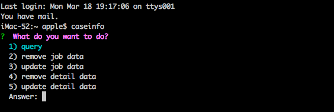

### step
1. parse excel, get the obj data
2. get the args: `excel path`
3. store the data(path) into mongodb
4. query data


### useage
```
npm install ghwakrf -g
case
```

#### mongoose使用总结
- 同样的表，Schema结构必须相同才可以访问，这里踩了一坑，就多了一个字段，折腾了几个小时，建议封装Schema


### 效果展示


